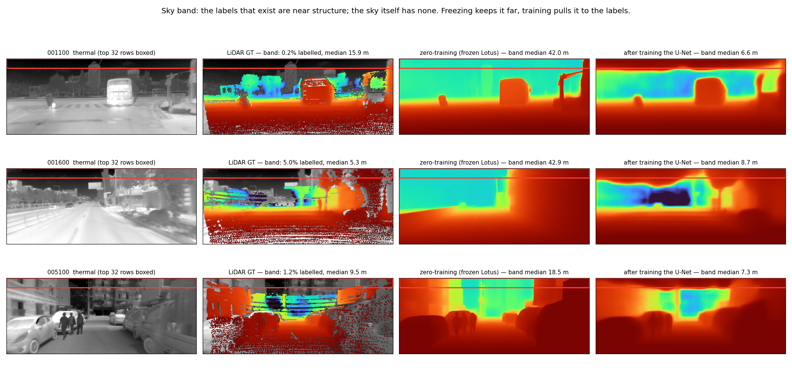

# 天空被判成近处：问题陈述与检索线索

**2026-08-05** · 一页版，供文献检索与对外讨论。
完整证据链与代码位置见 `WEEK3_LOCAL_FINDINGS_20260805.md` §1。

---

## 一句话

> 在**稀疏 LiDAR 真值**上微调一个**预训练的稠密深度先验**（Stable Diffusion → Lotus-G），
> 模型在**天空区域**把深度从"远"学成了"近"；而同一条链路**不训练**时天空是对的。
> 原因不是代码或标注错误，而是**稀疏真值在图像上带的采样有选择性**：
> 那个高度唯一能被激光打到的是近处物体，天空永远零回波，
> 于是模型在那一带看到的每一个标签都是"近"。

---

## 1 设置

| 项 | 值 |
|---|---|
| 数据 | MS2（多光谱自动驾驶），**热像**左目 256×640 |
| 真值 | 投影稀疏 LiDAR（`proj_depth/<seq>/thr/depth_filtered`），**全图覆盖率 26.5%** |
| 先验 | Lotus-G（Stable Diffusion 2.1 微调而来的深度模型），**867 M 参数全解冻** |
| 损失 | 视差空间 masked scale-shift-invariant L1，**只在有回波像素上算** |
| 评估 | 官方 BMSD 协议，逐帧仿射对齐，**同一张 valid mask** |

## 2 现象

最上 32 行（≈ 天空所在高度）的**预测深度中位**：

| | 上带预测中位 |
|---|---:|
| **零训练**（冻结 VAE + 冻结 Lotus-G） | **41.3 m** ← 正确（某帧 GT 39.5 m ↔ 预测 41.1 m） |
| 微调 U-Net（867 M） | **7.3 m** |
| 微调 U-Net + caption | **5.2 m** |
| 只训 7 M adapter、U-Net 冻结 | 16.1 m（塌得最少） |

**冻得越多，天空保得越好；而整体精度正好反过来**（冻结那条 AbsRel 六线最差）。



*红框 = 最上 32 行。第二栏里那条带子仅有的 GT 点全落在楼顶、门架、招牌上，天空一个点都没有。*

## 3 已排除：不是 bug

| 假设 | 检验 | 结果 |
|---|---|---|
| 掩码/损失写错了 | 逐行读 `load_gt_disparity` / `masked_ssi_l1` / `ssi_grad_matching` / `official_valid_mask` | 四处自洽；天空梯度**恰好为 0**，评估权重**恰好为 0** |
| 标签打歪了（投影错位、飞点） | 热像判别：LWIR 天空又冷又平、物体偏暖。取上带每个有 GT 像素在该带**温度分布里的百分位**（0.50 = 与天空无异） | **0.70**，84.6% 比该带中位更暖，**连孤立单点也是** → 是真物体，不是飞点 |
| 是过滤/多帧累积造的假点 | 比原始 `depth` 与 `depth_filtered` 在同一带的深度 | 7.2–12.0 m vs 8.0–10.8 m，**一致** |
| 是仿射对齐/钳位造出来的"近" | 对齐路径 `1/clip(pred·s+t, 1e-3, ∞)` 再 clip 到 [0.1, 80]：视差过小只会被推到 **80 m（远）** | 实测上带钳位比例**恒为 0.0%**（远近两端都是）→ 那个"近"是网络真的输出的 |

## 4 机制

- 上带（第 0–31 行）**97~98% 的像素没有任何标签**；
- 剩下 2~3% **全是近处**：GT 中位 **8–11 m**，**>89% 在 15 m 以内**（四条序列一致）；

  | 序列 | 上带有效率 | GT 中位 | <15 m |
  |---|---:|---:|---:|
  | train `10-59-33` | 1.60% | 8.02 m | 93.4% |
  | train `11-37-46` | 1.45% | 10.75 m | 89.1% |
  | val `11-23-45` | 1.58% | 8.05 m | 98.4% |
  | test `16-08-46` | 2.45% | 10.26 m | 91.1% |

- 模型收敛到**可见标签的均值**（预测 7.3 m ↔ 标签 8–11 m）。
  **它学得完全正确**，错的是这份标签在该区域**系统性偏近**（missing not at random）；
- **评估用同一张 mask**，所以从 41 m 掉到 7 m 这个变化在 AbsRel / RMSE / δ₁ 上
  **完全隐形** —— 训练过程中没有任何信号会阻止它，指标上也永远看不到。

⚠️ 不要过度解读：模型学到的是**全数据集**上带标签的均值，**不是逐帧跟着该帧的标签走**
（三帧实测 GT 15.9 / 5.3 / 9.5 m 对预测 6.6 / 8.7 / 7.3 m，逐帧不相关）。

## 5 待做的决定性实验

两种解释对同一个操作给出**相反**的预测：

| 解释 | 机制 | 把上带标签从损失里删掉之后 |
|---|---|---|
| 旧：无监督区自由漂移 | 那里没梯度，参数一动就漂 | **天空照样塌** |
| 新（本文）：上带标签系统性偏近 | 唯一的信号是"近"，模型照学 | 没信号可学 → **天空保持在 39 m 附近** |

一个 `--loss-exclude-top-rows 32` 开关（只改 `valid_mask`）+ b 线 5 epoch ≈ 5.5 GPU·小时。
判据看**上带中位**，不看 AbsRel —— 少了 ~1.5% 的监督像素，AbsRel 本来就会略降。

---

## 6 检索线索

### 关键词（英文优先，中文文献少）

```
sparse LiDAR ground truth + sky region + monocular depth
no ground truth in sky / sky has no LiDAR returns / infinite depth sky
missing not at random (MNAR) / label selection bias + depth estimation
catastrophic forgetting / prior forgetting + fine-tuning diffusion depth model
sky mask loss / sky segmentation supervision + depth
Garg crop / Eigen crop
```

### 值得优先查的四条

1. **`Garg crop` / `Eigen crop`** —— KITTI 的标准评估**直接把图像上部裁掉**。
   如果原因正是那里没有真值，那说明**社区是回避了这个问题，不是解决了它**。
   这条最便宜，也最可能改变我们的叙述方式。
2. **KITTI 自监督深度**（monodepth2 一系）：同样的稀疏 LiDAR、同样没有天空回波，
   "天空被判成近处"是老问题，常见做法是引入**语义分割的天空 mask**，强制视差 ≈ 0。
3. **NeRF / 3DGS 户外重建**：普遍需要显式 **sky mask** 或 sky model，可以借它们的表述。
4. **Marigold / Lotus 自己微调用的是什么数据** —— 我的理解是**合成数据的稠密深度**
   （Hypersim、Virtual KITTI 2），也就是作者**本来就避开了稀疏真值微调**。
   **这一条要去原论文确认**；若属实，说明我们踩的是一个他们绕开的坑。

### 我们已有的反面对照

**原版 AnyThermal 没有这个问题**（远端退化 far/all ×1.13，我方最好 ×1.90）。
它的做法是：第一阶段用**无标注的自监督蒸馏**建先验（对齐到 DINOv2，监督覆盖整张图、
天空在内）→ **冻住骨干** → 第二阶段才用稀疏 LiDAR 只训一个小的深度头。
**先验从头到尾没被 26.5% 的稀疏监督改写过。**

### 搜的时候注意区分

我们这个案例的特殊组合：**输入是热像**（不是 RGB）、**先验来自文生图扩散模型**
（不是 ImageNet/DINO）、**全解冻 867 M** 去接 26.5% 覆盖率的稀疏监督。
前两条大概率搜不到同样的组合；**第三条「稀疏监督改写稠密先验」才是通用的那部分**，
按这个去搜命中率最高。
